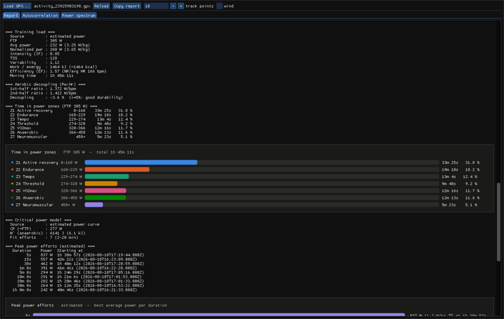
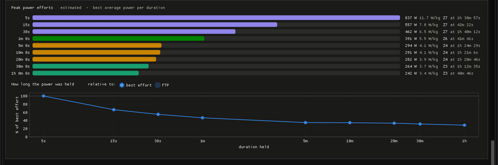
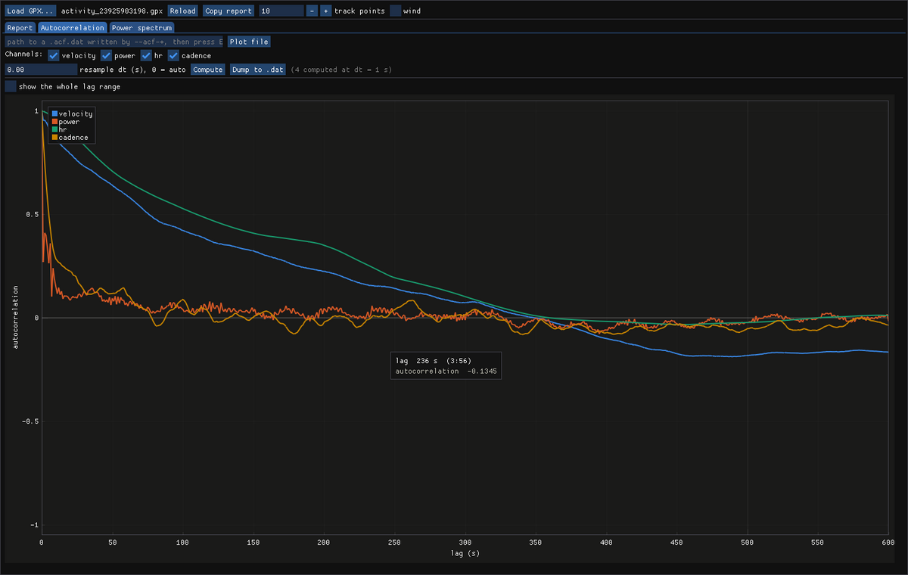
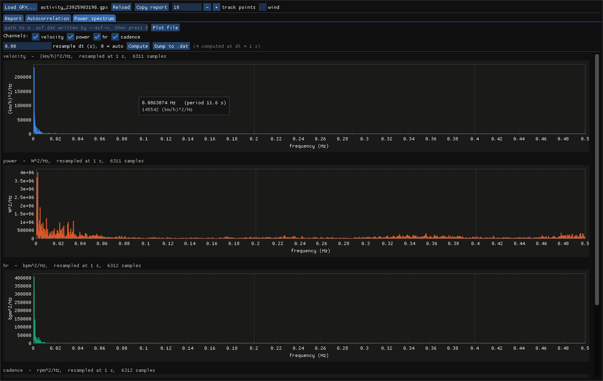

# GPXAna

A C++17 toolkit for analysing cycling GPX files: track statistics, hill
detection, a physics-based power estimate, training metrics, and the
autocorrelation and power spectrum of every recorded channel. Ships as a
command-line tool (`gpx_reader`) and an optional desktop GUI (`gpxana_gui`).

## Features

- Parse GPX 1.1 files (Garmin Connect and compatible devices)
- Per-track statistics: distance, elevation gain/loss, duration, average speed,
  average temperature, heart rate, cadence and power, average climb and descent
  gradient
- Hill detection table: distance, elevation gain, average grade and average
  estimated power per climb
- Estimated power (Strava-style physics model) with optional comparison against
  measured power, and a time-vs-power CSV export
- Optional historical wind (Open-Meteo) folded into the aerodynamic term for a
  more accurate power estimate
- Fastest segment finder: sliding-window search by distance or time
- Autocorrelation function and power spectrum of each time-dependent channel
  (velocity, power, heart rate, cadence, crank torque), exported as 4-column
  text files
- Training metrics: Normalized Power, Intensity Factor, TSS, Variability Index,
  energy (kJ/kcal) and watts-per-kilo
- Power, heart-rate and cadence distributions (time in zone / band)
- Aerobic decoupling (Pw:Hr) and Efficiency Factor (NP/HR) — durability/fitness
- Peak-power efforts table (best 5 s … 1 h, with where in the ride they occurred)
- Fatigue resistance: the same peak efforts recomputed after 500, 1000, 1500 …
  kJ of work, so the fade over a long ride is measured rather than guessed
- Quadrant analysis (pedal force × cadence) when the track has cadence
- Anaerobic-reserve "matches" burned, from the W' balance
- Per-distance split table (pace, power, HR, climbing per split)
- Climb VAM and Strava-style HC/1–4 categorisation in the hills table
- Critical-power model (CP and W') with an optional W'-balance export
- Multi-ride training trend (CTL / ATL / TSB) when several files are given
- Multiple `--dist` and `--time` queries supported in a single run
- Optional desktop GUI (Dear ImGui + ImPlot): several rides open at once, each
  with the report charted, its raw signals against time, its autocorrelation and
  power spectrum — and a view comparing every open ride by distance

## Requirements

- C++17-compatible compiler (e.g. GCC >= 8)
- CMake >= 3.16
- Internet access at first configure — [pugixml](https://github.com/zeux/pugixml)
  and [nlohmann/json](https://github.com/nlohmann/json) are fetched
  automatically via CMake `FetchContent`, no manual install needed
- The `curl` command-line tool on `PATH` — only needed at runtime for the
  optional `--wind` fetch (no libcurl dev package required)

Only for the optional GUI (`-DGPXANA_BUILD_GUI=ON`):

- OpenGL and X11 development headers (on Debian/Ubuntu:
  `libgl1-mesa-dev xorg-dev`)
- [GLFW](https://www.glfw.org/) >= 3.3 — a system install is used when CMake
  finds one, otherwise 3.5.1 is built automatically
- [Dear ImGui](https://github.com/ocornut/imgui) and
  [ImPlot](https://github.com/epezent/implot), fetched automatically

  These are downloaded once into `external/` (git-ignored) and reused, so they
  survive `rm -rf build`. The default command-line build resolves none of them.

## Building

```bash
mkdir build
cmake -S . -B build -DCMAKE_BUILD_TYPE=Release
cmake --build build --parallel
```

The binary is placed at `build/gpx_reader`.

To build the GUI as well, turn its option on. It is off by default, so the
command-line build above never resolves a GUI dependency:

```bash
cmake -S . -B build -DCMAKE_BUILD_TYPE=Release -DGPXANA_BUILD_GUI=ON
cmake --build build --parallel
```

That adds `build/gpxana_gui` alongside `build/gpx_reader`. Nothing under `src/`
changes: `gui/` compiles the analysis code into a static library and draws on
top of it.

## API documentation

The source is documented with Doxygen comments in the header files (both `src/`
and `gui/src/`). Generate the HTML reference with:

```bash
doxygen Doxyfile      # output in docs/html/index.html
```

(`docs/` is git-ignored; the README serves as the generated main page.)

## Usage

```
./build/gpx_reader <file.gpx> [more.gpx ...] [options]

Options:
  --points N       print first N track points (default: 10, use 0 to suppress)
  --dist  D        find fastest segment of D km    (e.g. --dist 5.0)
  --time  T        find fastest segment of T s     (e.g. --time 300)

Rider profile (training metrics):
  --ftp F          functional threshold power in W (default: 305)
  --weight W       body weight in kg for W/kg (default: 71.3; alias --rider)
  --lthr H         lactate-threshold HR in bpm (enables HR zones)
  --max-hr H       maximum HR in bpm (HR-zone fallback if no --lthr)
  --splits D       per-D-km split table (e.g. --splits 1.0)
  --crank L        crank-arm length in mm for quadrant analysis (default: 172.5)

Power estimation (runs by default):
  --mass  M        total rider+bike mass in kg (default: 80)
  --rider R        rider/body mass in kg (also W/kg; summed with --bike if --mass unset)
  --bike  B        bike mass in kg  (summed with --rider if --mass unset)
  --crr   C        rolling resistance coefficient (default: 0.005)
  --cda   A        aerodynamic drag area CdA in m^2 (default: 0.32)
  --drivetrain E   drivetrain efficiency 0..1 (default: 0.977)
  --smooth S       GPS speed smoothing window in s, tames spikes (default: 5; 0 off)
  --max-accel A    clamp on |acceleration| in m/s^2 (default: 3)
  --max-speed V    cap on raw step speed in m/s, drops GPS teleports (default: 30)
  --max-grade G    clamp on |grade| as a fraction (default: 0.30)
  --max-gap  S     steps longer than S seconds count as a stop (default: 10)
  --power-csv F    write a time-vs-power CSV to file F
  --xy F           write all per-point data as a #-commented XY table to F
  --power-curve F  write mean-maximal power curve (duration vs W) to F
  --power-hist F   write power histogram (time in each power band) to F
  --hist-bin W     histogram bin width in watts (default: 25)
  --wbal-file F    write the W'-balance time series to F (needs a CP fit)

Autocorrelation & power spectrum (4-col: lag, acf, freq, psd):
  --acf-velocity F       velocity autocorrelation + spectrum -> F
  --acf-power F          estimated power                     -> F
  --acf-power-measured F measured <power>                    -> F
  --acf-hr F             heart rate                          -> F
  --acf-cadence F        cadence (rpm)                       -> F
  --acf-torque F         crank torque (Nm)                   -> F
  --acf-dt S             uniform resample interval in s (default: auto = median)

Wind (Open-Meteo historical API; improves the aero term):
  --wind           fetch historical wind and apply it
  --wind-cache F   like --wind, but cache to / read from file F
  --wind-file F    apply wind from a local JSON file F (offline)
```

Multiple `--dist` and `--time` flags are supported and each is reported
separately.

### Examples

```bash
# Basic run — points, statistics, hills (with per-climb power) and power estimate
./build/gpx_reader ride.gpx

# Custom mass and aerodynamics, plus a time-vs-power CSV
./build/gpx_reader ride.gpx --points 0 --mass 78 --cda 0.30 --power-csv power.csv

# Suppress point listing; find fastest 1 km, 5 km, 5-minute and 10-minute segments
./build/gpx_reader ride.gpx --points 0 --dist 1.0 --dist 5.0 --time 300 --time 600

# Write a mean-maximal power curve and a power histogram (50 W bins)
./build/gpx_reader ride.gpx --points 0 --power-curve curve.txt --power-hist hist.txt --hist-bin 50

# Autocorrelation + power spectrum for selected channels (one flag each)
./build/gpx_reader ride.gpx --points 0 --acf-hr hr.txt --acf-cadence cad.txt
```

The power estimate is de-spiked before use: GPS speed is smoothed over a short
window (`--smooth`), and acceleration, speed, grade and long stops are bounded
(`--max-accel`, `--max-speed`, `--max-grade`, `--max-gap`) so position/elevation
noise can't produce physically impossible power. Loosen or disable these
(`--smooth 0`) to see the raw model output.

## Sample output

```
GPX file   : activity_22358886983.gpx
Recorded   : 2026-03-31T09:46:45.000Z
Tracks     : 1

--- Track points (showing first 3 of 5749) ---
[    1] lat=    48.227751  lon=     16.304489  ele=  239.80 m  time=2026-03-31T09:46:45.000Z  temp=21.0 C
[    2] lat=    48.227753  lon=     16.304492  ele=  238.00 m  time=2026-03-31T09:46:46.000Z  temp=21.0 C
[    3] lat=    48.227544  lon=     16.304466  ele=  237.80 m  time=2026-03-31T09:47:05.000Z  temp=20.0 C
  ... (5746 more points not shown)

=== Statistics for track: "Vienna Gravel/Unpaved Cycling" ===
  Type           : gravel_cycling
  Points         : 5749
  Total distance : 22.74 km
  Elevation gain : 729.2 m
  Elevation loss : 727.4 m
  Min elevation  : 232.4 m
  Max elevation  : 523.6 m
  Duration       : 1h 37m 19s
  Avg speed      : 14.0 km/h
  Avg temperature: 5.4 C
  Avg climb grade: +8.6 %
  Avg desc grade : -9.4 %


--- Hills (min grade: 1%, min gain: 10 m, gap tolerance: 20 m) ---
   #    Distance      Gain    Avg grade   Start ele     End ele  Start time
 ---  ----------  --------  -----------  ----------  ----------  ------------------------
   1      5.00 km   243.6 m  +    4.9 %     232.4 m     476.0 m  2026-03-31T09:47:36.000Z
   2      0.33 km    12.6 m  +    3.9 %     438.6 m     451.2 m  2026-03-31T10:15:12.000Z
   3      5.91 km   242.0 m  +    4.1 %     281.6 m     523.6 m  2026-03-31T10:22:51.000Z
   4      2.96 km   149.8 m  +    5.1 %     299.0 m     448.8 m  2026-03-31T11:00:59.000Z

Total: 4 hills


=== Fastest 5.00 km segment ===
  Avg speed  : 16.3 km/h
  Distance   : 5.002 km
  Duration   : 18m 24s
  Start      : 2026-03-31T10:13:48.000Z  (lat=48.255101, lon=16.265314)
  End        : 2026-03-31T10:32:12.000Z  (lat=48.258232, lon=16.245833)
  Point idx  : 1592 -> 2661


=== Fastest 5m 0s segment ===
  Avg speed  : 26.9 km/h
  Distance   : 2.242 km
  Duration   : 5m 0s
  Start      : 2026-03-31T11:18:54.000Z  (lat=48.224949, lon=16.277718)
  End        : 2026-03-31T11:23:54.000Z  (lat=48.227416, lon=16.304194)
  Point idx  : 5438 -> 5738
```

## GUI

`gpxana_gui` is an optional desktop front-end (Dear ImGui + ImPlot on
GLFW/OpenGL). It reimplements no analysis: it builds the same options the
command line does, calls the same `app::run()`, and captures the report you
would have got on stdout — so any section added to the analysis appears in the
GUI without a change on the GUI side. The charts are the same numbers as
structs rather than as text.

```bash
./build/gpxana_gui                                  # then use the Load button
./build/gpxana_gui morning.gpx evening.gpx          # or open several at once
```

Every file opens in a tab of its own, and `.gpx` files can be dragged onto the
window. The chooser takes several at a time; a file already open is focused
rather than loaded twice.



### Toolbar

These settings describe the rider rather than any one ride, so they apply to
every open file and changing one re-runs them all.

| Control | What it does |
|---|---|
| `Load GPX...` | Native file chooser (via `zenity`), multi-select. Without it, a path box appears instead. |
| `Reload all` | Re-run the analysis on every open file. |
| `track points` | How many points each report lists first — mirrors `--points`. |
| `wind` | Fetch historical wind and apply it, exactly as `--wind` does. Off by default; it is the only control that reaches the network. |

### File tabs

One per open ride, reorderable and closable, with the full path on hover. Each
holds four views of its own — Report, Signals, Autocorrelation, Power spectrum —
and each keeps its own track selection, channel choices and zoom, so two rides
can be examined in different ways side by side.

Once a second file is open, a **Compare** tab appears at the end of the bar.

### Report tab

The full text report in one scrolling page, with a chart placed directly below
the table it illustrates:

- **Time in power zones** and **time in cadence bands** — horizontal bars, one
  per zone, scaled to the largest so short ones stay visible; the printed
  percentages carry the true proportions.
- **Peak power efforts** — one bar per duration, shortest to longest, so the
  bars fall away as the power-duration staircase. Each is coloured by the zone
  it lands in, with the zone named beside it. Below it the same efforts read the
  other way round: how long each fraction of your power was held, against
  either the ride's best effort or FTP.
- **Fatigue resistance** — one line per duration, plotted against work already
  done, with the fade stated above it. A line that sags to the right is a rider
  losing power as the ride goes on; one that stays flat is durability.
- **Climbs** — one elevation profile per detected climb, shaded by the power
  zone each stretch was ridden in, with distance or time on the x axis.



Files with several tracks get a selector that switches every chart on the page.

### Signals tab

The ride's channels plotted raw against elapsed time — velocity, estimated and
measured power, heart rate, cadence, crank torque, elevation and temperature.
Where the spectral tabs answer *what repeats*, this answers *what happened, and
when*.

The plots are stacked rather than overlaid, because watts in the hundreds and
gradient in single digits cannot share a y axis. Stacking costs the ability to
read one signal against another, which linking the x axes buys back: zoom or pan
any plot and the rest follow, so a vertical line through the stack is one moment
in the ride. The axis is pinned to the data, and ticks read as elapsed clock
time rather than a raw second count.

### Compare tab

Every open ride's channels on shared axes, one plot per channel and one line per
ride. Available once a second file is open.

Rides are lined up **by distance** by default, because the question is usually
how two attempts at the same road differ and only distance puts the same climb
at the same place; elapsed time is a radio away for when the question is about
the effort instead. Switching between them resets the zoom, since the stored
span is kilometres in one mode and seconds in the other.

One plot per channel is possible here — unlike the Signals tab — precisely
because the same channel across rides shares a unit. Colour therefore identifies
the *ride* and is held across every plot, so the tab carries a key naming the
files in their colours, and hovering shows every ride's value at the cursor
rather than one: the gap between them is the point.

The channel list is the union of what the rides carry, not the intersection. Two
of four rides having no cadence is a fact worth seeing, not a reason to hide the
channel from the two that recorded it, so such a plot names the rides that could
not supply it.

### Autocorrelation and Power spectrum tabs

Both are computed on demand from the ride's channels by the same
`signal::compute_acf_psd` the `--acf-*` flags use, so the plots and those files
carry the same numbers.

Tick the channels you want, optionally set the resample interval (`0` = auto,
mirroring `--acf-dt`), and press `Compute`.

Two more controls sit alongside, for tying the plots to the exported files:

| Control | What it does |
|---|---|
| `Plot file` | Plot columns 3 and 4 of a `.acf.dat` written by `--acf-*`, exactly as they stand — nothing is recomputed. It adds to what is already shown, so a stored spectrum and a freshly computed one can be compared side by side. Useful for a file produced under options the GUI cannot reproduce (a different mass or CdA). |
| `Dump to .dat` | Write the computed spectra beside the GPX as `<channel>.gui.acf.dat`, in the same 4-column format `--acf-*` produces, so the two can be diffed rather than compared by eye. |

- **Autocorrelation** — every channel on shared axes, since all are
  dimensionless and start at 1, with a zero line marking where a signal stops
  resembling itself. Opens on the first 10 minutes of lag, where the structure
  is; a checkbox shows the whole range.

  

  Heart rate and velocity decay slowly over minutes; power and cadence fall away
  within seconds and then oscillate around zero.

- **Power spectrum** — one plot per channel, because each is in its own units
  squared per hertz. Linear axes over the full frequency range, drawing the same
  points as `plot 'x.acf.dat' u 3:4 w l`.

  

Hovering either plot shows where the cursor is, in that plot's units — lag and
autocorrelation on one, frequency and spectral density on the other. The
frequency readout carries the period alongside, in the same units as the
autocorrelation tab's lag axis, so a feature can be matched between the two
tabs without arithmetic.

## Output reference

### File header

| Field | Description |
|---|---|
| `GPX file` | Path to the input file |
| `Recorded` | Timestamp from the `<metadata><time>` element |
| `Tracks` | Number of `<trk>` elements found in the file |

### Track points listing

One line per point showing index, latitude, longitude, elevation, timestamp
and (if present) air temperature, heart rate, cadence and power. Controlled by
`--points N`.

### Statistics block

| Field | Description |
|---|---|
| Type | Activity type from `<type>` element |
| Points | Total number of track points |
| Total distance | Cumulative Haversine distance in km |
| Elevation gain | Sum of all positive elevation deltas in m |
| Elevation loss | Sum of all negative elevation deltas (as a positive value) in m |
| Min / Max elevation | Lowest and highest recorded elevation in m |
| Duration | Time from first to last point (`HhMmSs`) |
| Avg speed | Total distance divided by total duration in km/h |
| Avg temperature | Mean air temperature from `ns3:atemp` extension in °C |
| Avg heart rate | Mean / min / max heart rate from `ns3:hr` in bpm |
| Avg cadence | Mean / min / max cadence from `ns3:cad` in rpm |
| Avg power | Mean / min / max power from `<power>` in watts |
| Avg climb grade | Mean gradient of all uphill steps (%) |
| Avg desc grade | Mean gradient of all downhill steps (%, negative value) |

### Hills table

One row per detected climb, listed in chronological order.

| Column | Description |
|---|---|
| `#` | Hill number (chronological order) |
| Distance | Horizontal distance of the climb in km |
| Gain | Elevation gained from start to peak in m |
| Avg grade | Mean gradient over the climb distance (%) |
| Start ele | Elevation at the start of the climb in m |
| End ele | Elevation at the peak in m |
| Avg power | Mean estimated power over the climb in watts |
| Start time | ISO-8601 timestamp at the start of the climb |

### Estimated power block

| Field | Description |
|---|---|
| Model | Mass, Crr, CdA and drivetrain efficiency used |
| Avg / Max est. power | Mean / maximum estimated power in watts |
| Work done | Total mechanical work in kJ |
| Measured avg | Mean measured power (only if `<power>` present) |
| Mean abs error / bias | Estimate-vs-measured error (only if `<power>` present) |

### Fastest segment block

| Field | Description |
|---|---|
| Avg speed | Average speed over the found segment in km/h |
| Distance | Actual distance covered by the segment in km |
| Duration | Elapsed time of the segment (`HhMmSs`) |
| Start / End | ISO-8601 timestamp and coordinates (lat/lon) |
| Point idx | Index range into the track points array |

## Hill detection

Hills are detected using a state machine that scans the track points in order.
A step is classified as uphill when its gradient meets or exceeds
`MIN_GRADE_PCT`. Short flat or downhill sections within a climb are tolerated
up to `GAP_TOLERANCE_M` of cumulative descent before the hill is considered
finished. A completed climb is only recorded if its total elevation gain
reaches `MIN_GAIN_M`.

| Parameter | Default | Description |
|---|---|---|
| `MIN_GRADE_PCT` | 1.0 % | Minimum step gradient to enter climbing state |
| `MIN_GAIN_M` | 10.0 m | Minimum total gain for a climb to be recorded |
| `GAP_TOLERANCE_M` | 20.0 m | Cumulative descent absorbed before ending a hill |

## Fastest segment algorithm

Both the distance-based and time-based searches use an **O(N) two-pointer
sliding window**. A cumulative distance and timestamp table is built once per
query, then the right pointer advances until the window satisfies the requested
size. The window with the highest average speed (`distance / duration`) is
kept. If the requested window is larger than the entire track, the result is
marked invalid and a notice is printed.

## Power estimation

Power is estimated from the track kinematics using the same physics model
Strava uses (the Martin et al. 1998 road-cycling model). For each step, power at
the pedals is the sum of four resistive forces multiplied by ground speed,
divided by drivetrain efficiency:

```
P = (1/η) · [ P_gravity + P_rolling + P_aero + P_accel ]

P_gravity = m · g · sin(θ) · v          (climbing)
P_rolling = m · g · cos(θ) · Crr · v    (rolling resistance)
P_aero    = ½ · ρ · CdA · (v + v_hw)² · v   (air resistance)
P_accel   = m · a · v                   (acceleration)
```

where `θ = atan(grade)`, `v` = ground speed, `a` = acceleration and `v_hw` = the
headwind component. `v` is the rider's speed over the ground; `(v + v_hw)` is the
airspeed the drag force depends on. Without `--wind` there is no wind data, so
`v_hw = 0` and the aero term reduces to `½·ρ·CdA·v³`; see [Wind](#wind) for how
it is obtained and projected onto the direction of travel.

| Parameter | Default | Notes |
|---|---|---|
| Mass (rider+bike) | 80 kg | `--mass`, or `--rider` + `--bike` |
| `Crr` | 0.005 | quality road tyres on asphalt (`--crr`) |
| `CdA` | 0.32 m² | rider on the hoods (`--cda`) |
| Drivetrain efficiency | 0.977 | ≈2.3 % loss (`--drivetrain`) |
| Air density `ρ` | computed | from elevation + air temperature; 1.225 fallback |

Air density is computed per point from elevation (International Standard
Atmosphere barometric pressure) and, when present, the recorded air temperature.
Coasting/downhill samples that yield negative power are clamped to 0 W.

The estimate is reported as average/max power and total work (kJ), each climb in
the hills table gets an **average power** column, and — when the GPX carries a
measured `<power>` channel — the summary also prints the measured average, mean
absolute error and mean bias so the estimate can be validated. `--power-csv F`
writes a `time,elapsed_s,est_power_w[,measured_power_w]` row per track point.

**Accuracy caveats:** like Strava, the model cannot see wind, exact tyre/surface
`Crr`, or real rider aerodynamics, so absolute numbers are approximate — most
accurate on sustained climbs where gravity dominates.

### Wind

Wind is fetched from the **[Open-Meteo Historical Weather API](https://open-meteo.com/en/docs/historical-weather-api)**
(free, no API key, ERA5 reanalysis) and folded into the aerodynamic term via the
headwind component `v_hw`:

```
v_hw = wind_speed · cos(wind_from_direction − rider_heading)
```

The rider heading is the GPS bearing between consecutive points; the wind
direction is Open-Meteo's meteorological "blows from" bearing. A wind from ahead
raises estimated power, a tailwind lowers it. One hourly value is requested at
the track centroid for the ride's date(s) and matched to each point by nearest
hour. HTTP is performed by invoking the `curl` command-line tool.

| Flag | Behaviour |
|---|---|
| `--wind` | fetch from Open-Meteo and apply |
| `--wind-cache F` | fetch once, cache to `F`, reuse on later runs (offline-friendly) |
| `--wind-file F` | apply wind from a local JSON file (Open-Meteo shape); no network |

When wind is applied the estimated-power block reports the average headwind and
the CSV gains a `headwind_ms` column.

**Caveats:** ERA5 is a ~25 km / hourly reanalysis with a ~5-day delay, so wind is
a regional hourly estimate — it captures the prevailing wind of the day, not
gusts or local terrain effects (valleys, tree cover). For rides in the last few
days the archive may not yet have data.

## Autocorrelation & power spectrum

Each time-dependent channel has its own flag, and each names the file it writes
to — `--acf-velocity F`, `--acf-power F` (estimated), `--acf-power-measured F`
(the file's `<power>`), `--acf-hr F` and `--acf-cadence F`. Only the channels you
ask for are computed; a requested channel the track doesn't carry (or a constant
signal) is skipped with a message. With more than one track the output name gains
a `.N` suffix per track.

Each file is a 4-column, `#`-commented table:

| Column | Meaning |
|---|---|
| 1 `lag_s` | time lag τ of the autocorrelation (s) |
| 2 `autocorr` | normalized autocorrelation at that lag (`acf[0] = 1`) |
| 3 `freq_hz` | frequency (Hz), from 0 to the Nyquist frequency `1/(2·dt)` |
| 4 `psd` | one-sided power spectral density at that frequency (`unit²/Hz`) |

**Method.** GPX samples are irregular in time, so each channel is first linearly
resampled onto a uniform grid of spacing `dt` (`--acf-dt`, default = the median
sample interval, at least 1 s). The mean is removed, and the
[Wiener–Khinchin theorem](https://en.wikipedia.org/wiki/Wiener%E2%80%93Khinchin_theorem)
is applied via an FFT: the power spectrum is `|FFT(signal)|²` and the
autocorrelation is the inverse FFT of that spectrum.

The lag/ACF pair (time domain) and the freq/PSD pair (frequency domain) have
different natural lengths, so the shorter columns are padded with `NaN` to keep
the file rectangular — plot columns 1:2 for the autocorrelation and 3:4 for the
spectrum:

```bash
gnuplot -p -e "plot 'power.txt' using 1:2 with lines"                 # ACF
gnuplot -p -e "set logscale xy; plot 'power.txt' using 3:4 with lines" # PSD
```

## Models and equations

Every formula the tool uses, in one place, with the constants it uses them with.
Section links go to the fuller discussion.

### Geometry

Distances are horizontal (2D); elevation never enters a distance.

```
Haversine, R = 6 371 000 m
  a = sin²(Δφ/2) + cos φ₁ · cos φ₂ · sin²(Δλ/2)
  d = 2R · atan2(√a, √(1−a))

Initial bearing, for projecting wind onto the direction of travel
  θ = atan2( sin Δλ · cos φ₂ ,
             cos φ₁ · sin φ₂ − sin φ₁ · cos φ₂ · cos Δλ )

grade = Δelevation / d          (only for steps with d ≥ 1 m)
VAM   = elevation gain / hours  (metres of ascent per hour)
```

### Power — [details](#power-estimation)

```
P = (1/η) · [ m·g·sin θ ·v  +  m·g·cos θ ·Crr·v
              +  ½·ρ·CdA·(v + v_hw)²·v  +  m·a·v ]
```

Air density is not assumed. It comes from the International Standard Atmosphere
barometric formula, then the ideal-gas law with the recorded air temperature:

```
p = P₀ · (1 − L·h / T₀)^5.257        P₀ = 101 325 Pa, T₀ = 288.15 K, L = 0.0065 K/m
ρ = p / (R_specific · T)             R_specific = 287.05 J/(kg·K), T = temp + 273.15
```

giving ≈1.225 kg/m³ at sea level and 15 °C. Headwind is the wind projected onto
the heading, positive into the rider:

```
v_hw = w · cos(θ_wind_from − θ_heading)
```

### Torque

Torque needs no crank length — that would give pedal *force*, which is what the
quadrant analysis wants instead.

```
τ = P / ω        ω = 2π · cadence / 60      [N·m]
```

Samples below 20 rpm are dropped rather than clamped: the quotient explodes as
the cranks slow, and that is a sensor artefact rather than a rider.

### Training load — [details](#training-load)

Computed on a 1 Hz grid over moving time only.

```
NP  = ( mean( rolling₃₀ₛ(P)⁴ ) )^¼      fourth root of the mean fourth power
IF  = NP / FTP
VI  = NP / mean(P)
TSS = moving_s · NP · IF / (FTP · 3600) · 100
EF  = NP / mean(HR)
kJ  = ∫ P dt / 1000                     reported as kcal too, see below
```

Mechanical kJ is reported unchanged as dietary kcal: human cycling efficiency of
about 24 % and the 4.184 kJ per kcal nearly cancel.

### Aerobic decoupling — [details](#aerobic-decoupling-pwhr)

The ride is split at its midpoint in elapsed time and each half's
time-weighted power-to-heart-rate ratio compared:

```
r₁ = mean(P)₁ / mean(HR)₁        first half
r₂ = mean(P)₂ / mean(HR)₂        second half
Pw:Hr = (r₁ − r₂) / r₁ · 100 %   positive = HR drifted up for the same power
```

### Critical power — [details](#critical-power-model)

The two-parameter hyperbolic model, fitted as a straight line. Over efforts of
2–20 minutes, `P = CP + W'/t` is linear in `1/t`, so a least-squares regression
of power on `1/t` gives the slope as W' and the intercept as CP:

```
P(t) = CP + W'/t     fitted over 120 s ≤ t ≤ 1200 s
```

W'-balance follows Skiba–Clarke: above CP the reserve drains at the excess,
below CP it refills in proportion to how depleted it already is.

```
P > CP :  W'bal −= (P − CP) · dt
P ≤ CP :  W'bal += (CP − P) · (W' − W'bal)/W' · dt      capped at W'
```

A **match** is counted with hysteresis, so one deep effort is not counted
repeatedly as the balance wavers: the reserve must fall below 50 % of W' to
count, and recover above 75 % before another can be counted.

### Fatigue resistance — [details](#fatigue-resistance)

The peak-effort search restricted to windows that *start* after a given amount
of work has been done:

```
best(D, K) = max over windows [t₀, t₁] of  ∫P dt / (t₁ − t₀)
             subject to  t₁ − t₀ ≥ D  and  ∫₀^t₀ P dt ≥ K

fade = (best(D, K_first) − best(D, K_last)) / best(D, K_first) · 100 %
```

### Quadrant analysis — [details](#quadrant-analysis)

```
CPV  = cadence/60 · 2π · crank_length        circumferential pedal velocity [m/s]
AEPF = P / CPV                               average effective pedal force  [N]
```

The crosshair sits at FTP delivered at 90 rpm.

### Training trend — [details](#multi-ride-trend-ctl-atl-tsb)

Two exponentially weighted moving averages of daily TSS, over 42 and 7 days,
with days between rides counted as zero:

```
k = 1 − exp(−1/τ)          τ = 42 d for CTL, 7 d for ATL
CTL += (TSS − CTL) · k_ctl
ATL += (TSS − ATL) · k_atl
TSB  = CTL − ATL           form entering the day, before that day's ride
```

### Spectra — [details](#autocorrelation-power-spectrum)

The channel is resampled onto a uniform grid, the mean removed, and zero-padded
to `N ≥ 2M` so the inverse transform gives the linear rather than the circular
autocorrelation:

```
PSD(f_j) = (dt/M) · |X_j|²           interior bins doubled to fold in negative f
f_j      = j / (N·dt)                j = 0 … N/2, so f_max = 1/(2·dt)
ACF(τ)   = IFFT(|X|²)(τ) / IFFT(|X|²)(0)
```

Which integrates to the variance — a Parseval check the normalisation satisfies.

## Interpreting the results

The two curves answer different questions. The **autocorrelation function (ACF)**
tells you about *timescales* — "how long does this signal stay similar to
itself?" The **power spectrum (PSD)** tells you about *periodicity and where the
variability lives* — "is the ride dominated by slow drifts or fast surges, and is
anything rhythmic?" They are two views of the same information (one is the
Fourier transform of the other), so use whichever makes a given feature obvious.

### Reading the two curves

**Autocorrelation (column 2 vs lag, column 1).** Always starts at `1.0` at lag 0
and decays as the lag grows.

- **Correlation time** `τc` — the lag where the ACF first drops to about `1/e`
  (≈ 0.37). This is the signal's *memory*: how long, on average, it holds its
  value. A large `τc` (minutes) means smooth, steady, persistent; a small `τc`
  (seconds) means jumpy and rapidly changing.
- **Oscillation** — if the ACF dips below zero and swings back up periodically,
  the signal is *periodic*, and the spacing between ACF peaks is the period.
- **A raised, slowly-decaying tail** — a long trend/drift over the ride (e.g.
  heart-rate drift).

**Power spectrum (column 4 vs frequency, column 3).** Shows how the signal's
variance is spread across frequencies (period = `1 / frequency`).

- **A sharp peak** at frequency `f` means a repeating pattern with period `1/f`
  (structured intervals, circuit laps, regular rollers).
- **Energy piled at low frequency** (steep fall-off) = slow changes dominate =
  steady riding. **A fat high-frequency tail** = lots of rapid fluctuation =
  surgy riding.
- The DC bin (`f = 0`) is ≈ 0 by construction — the mean is removed, so the
  spectrum shows *fluctuations about your average*, not the average itself.

### What each channel tells you

#### Power (`--acf-power`, `--acf-power-measured`) — the most useful for training

This is the spectral view of how evenly you paced.

| You see | It means | To improve |
|---|---|---|
| ACF stays high for minutes; PSD steeply low-frequency | Steady, even effort — ideal for a time trial, sustained climb or endurance block | Already good; this is the target for steady efforts |
| ACF collapses within seconds; fat high-frequency PSD tail | Surgy, stop-and-go effort — crit, group ride, technical terrain, or ragged pacing | Anticipate hills/corners, feather rather than stab the pedals; smoothing power lowers the high-frequency tail and usually raises sustainable output |
| ACF oscillates with period `T`; sharp PSD peak at `1/T` | Structured intervals with cycle length `T` (e.g. 40 s on / 20 s off → `T` = 60 s → peak at ≈ 0.017 Hz) | Confirms you actually held the prescribed work/rest structure — a fuzzy or absent peak means the intervals drifted |
| Estimated vs measured PSD differ mostly at high frequency | Real power meter captures micro-surges the physics estimate smooths out | Those micro-surges above threshold cost disproportionate energy — flattening them is "free" endurance |

The correlation time of power is essentially a Variability-Index-style measure:
**longer `τc` and less high-frequency energy = more even, more sustainable
riding.**

#### Heart rate (`--acf-hr`)

Heart rate is a slow, inertial response to effort (cardiovascular time constant
of roughly 30–60 s), so its curves look very different from power — *by design,
not because the data is bad*.

- Expect a **long correlation time (minutes)** and a PSD that collapses almost
  entirely to the lowest frequencies.
- **Compare the HR spectrum with the power spectrum.** Above some frequency the
  HR spectrum falls well below the power spectrum: that is your body's low-pass
  cutoff. Efforts shorter than ~1–2 minutes barely move HR — which is exactly why
  **HR is a poor guide for short/interval efforts; trust power there** and use HR
  for steady aerobic pacing.
- A rising lowest-frequency component (beyond the effort structure) is **cardiac
  drift** — heat, dehydration or fatigue pushing HR up at constant power.
  Actionable: cool, fuel, hydrate, or start steadier.

#### Velocity (`--acf-velocity`)

- Correlation time = how long you hold a steady speed — long on open roads,
  short in traffic or on twisty descents.
- **PSD peaks reveal repeating route structure:** laps of a circuit show a peak
  at `1 / lap-time`; evenly spaced rollers show a peak at their spacing.
- Comparing velocity with power: on the flat, velocity tracks power closely; on
  rolling terrain, velocity carries extra low-frequency content from the gradient
  even when your power is constant — a quick way to see how terrain-driven the
  ride was.

#### Cadence (`--acf-cadence`)

- Correlation time ≈ how long you stay in a gear before shifting. Long and smooth
  on a flat road or trainer; choppy on rolling terrain or in stop-and-go riding.
- Frequent coasting shows up as cadence dropping to zero, adding both low- and
  high-frequency content.
- **A tight, high-`τc` cadence** means consistent pedalling; a jumpy cadence with
  lots of high-frequency energy means frequent shifts/coasting. For steady
  efforts, holding cadence steady tends to steady your power too.

### Reading a whole ride at a glance

- **Well-paced time trial / climb:** power and velocity ACFs decay slowly, their
  PSDs are steep and low-frequency, HR sits high with a long `τc`. Clean and
  boring is the goal.
- **Interval workout:** clear PSD peaks in power (and often HR/velocity) at the
  interval-cycle frequency; oscillating ACFs. Missing/blurry peaks mean the
  structure slipped.
- **Group ride / crit:** broad, high-frequency-heavy PSDs and short correlation
  times across power, velocity and cadence — lots of surging and coasting.
- **Fatigue / heat:** power structure unchanged, but the HR spectrum grows a
  stronger very-low-frequency component (drift).

### Caveats (so you don't over-read the plots)

- **Nyquist limit.** At the default 1 s grid the highest visible frequency is
  0.5 Hz (period 2 s). This means the **pedal-stroke rate is invisible**: 90 rpm
  is a 1.5 Hz crank rate, far above Nyquist. The cadence channel is your
  *reported average rpm over time*, not the crank-rotation signal — don't look
  for a "pedalling" peak.
- **Gaps and stops.** Resampling interpolates across dropouts and stops, which
  injects mostly spurious low-frequency energy. A ride with long stops will look
  more low-frequency than it really was.
- **Non-stationarity.** A whole ride mixes regimes (warm-up, climbs, fatigue), so
  one global spectrum blends them. For a specific claim — "were my intervals
  on-period?" — analyse just that segment of the ride.
- **Trend leakage & estimator bias.** The mean is removed but a linear drift is
  not, so slow trends land in the lowest bins; and the ACF is slightly attenuated
  at large lags (standard biased estimator). Read the *shape* and *peak
  locations*, not the absolute values of the far tail.

## Training analysis

These run by default from the estimated power (or the measured `<power>` when the
track carries it), using the rider profile flags — FTP (`--ftp`, default 305 W)
and body weight (`--weight`/`--rider`, default 71.3 kg).

### Training load

- **Normalized Power (NP)** — 30 s rolling average of power, then the fourth
  root of the mean fourth power; the effort "felt" harder than the plain average
  because surges cost disproportionately.
- **Intensity Factor (IF)** = NP / FTP — how hard relative to threshold.
- **Training Stress Score (TSS)** = duration × NP × IF / (FTP × 3600) × 100 — the
  ride's overall training load (≈100 = one hour all-out at threshold).
- **Variability Index (VI)** = NP / average power — pacing smoothness (≈1.0 steady,
  higher = surgy).
- **Energy** in kJ and (≈ equal) kcal, and **watts-per-kilo** for average and NP.
- **Efficiency Factor (EF)** = NP / average heart rate — an aerobic-fitness marker;
  rising EF at the same effort over weeks means you're getting fitter.

Moving time excludes stops (steps longer than 20 s are dropped).

### Zones

Time spent in each **power zone** (Coggan 7-zone model as % of FTP) and, when
`--lthr` or `--max-hr` is given, each **heart-rate zone** (5-zone, % of LTHR or
max HR). Shows at a glance whether the ride was recovery, endurance, tempo or
threshold work.

A **cadence distribution** runs alongside them when the track carries cadence.
Its bands are absolute rather than a fraction of anything, because unlike power
and heart rate cadence has no per-rider reference to scale against — 90 rpm is
90 rpm whoever is pedalling. Coasting is excluded rather than counted as
grinding, so a descent does not swamp the pedalling that actually happened. It
says how the work was delivered, where the power zones say how hard it was.

### Aerobic decoupling (Pw:Hr)

Splits the moving time in half and compares the power-to-heart-rate ratio of each
half. A decoupling above ~5 % means heart rate drifted up for the same power —
the classic fingerprint of fatigue, heat or dehydration; below ~5 % indicates
good aerobic durability. Needs heart-rate data.

### Peak power efforts

The best average power sustained over each of a set of durations (5 s … 1 h),
with the elapsed time and timestamp of where each effort occurred — e.g. "best
5-min: 308 W starting at 58m44s". Uses measured power when the track carries it.

### Fatigue resistance

The peak-power table says what the rider can do; it does not say when in the
ride they did it. Twenty minutes at 300 W in the first hour and the same twenty
minutes after 2000 kJ are different efforts, and the gap between them is what
separates riders who hold their form to the end of a long day from riders who do
not.

The same best-effort search runs again for each duration, with the window's
start bounded below by the point at which a given amount of mechanical work had
already been done — so each column is the same question asked of a
progressively more tired rider:

```
=== Fatigue resistance (estimated), over 2140 kJ ===
  Best power for each duration, starting only after this much work:
   Duration      0 kJ    500 kJ   1000 kJ   1500 kJ   2000 kJ    Fade
      1m 0s     313 W     313 W     313 W     270 W     246 W  +21.4 %
      5m 0s     243 W     243 W     238 W     226 W     202 W  +16.9 %
     20m 0s     211 W     211 W     208 W     208 W         -   +1.1 %
```

Work, not elapsed time, indexes the table: two hours of climbing and four hours
of flat are not the same fatigue. Thresholds the ride never reached are dropped
rather than shown as empty columns, so a short ride yields a short table, and the
fade compares the freshest reading against the deepest one actually reached.

A large fade at the long durations is the signature that matters — it is aerobic
durability rather than a bad sprint. The row above shows a rider whose
twenty-minute power barely moved over 2140 kJ while their one-minute power fell
a fifth: steady endurance intact, top end gone.

### Quadrant analysis

When the track has cadence, splits riding time into four quadrants around a
crosshair set at FTP and 90 rpm, using average effective pedal force
(AEPF = power / pedal velocity) and circumferential pedal velocity
(CPV = cadence × 2π × crank / 60):

- **Q2 high force / low cadence** — grinding big gears (muscular load)
- **Q1 high force / high cadence** — hard, fast pedalling (sprints, attacks)
- **Q4 low force / high cadence** — spinning easily
- **Q3 low force / low cadence** — soft-pedalling / easy

It shows the muscular-vs-cardiovascular character of the ride. Set crank length
with `--crank` (mm).

### Anaerobic reserve (W' matches)

From the W'-balance series, counts the "matches" burned — distinct deep
expenditures of the anaerobic reserve (a dip below 50 % of W' after recovering
above 75 %) — plus the lowest balance reached and how much was left at the end.
A quick read on how many hard efforts the ride demanded and whether you emptied
the tank.

### Splits

`--splits D` prints a per-`D`-kilometre table: distance, time, average speed,
average power, average heart rate and elevation gained — a quick read on pacing.

### Climb VAM and category

The hills table gains **VAM** (vertical ascent metres per hour, the standard
climbing-performance number) and a Strava-style **category** (HC, 1–4) from the
climb score `length(m) × average grade(%)`.

### Critical-power model

Fits the two-parameter model `P(t) = W'/t + CP` to the ride's mean-maximal power
curve over 2–20 minute efforts: **CP** (critical power, ≈ FTP) and **W'** (the
anaerobic work capacity above CP). `--wbal-file F` writes the W'-balance time
series (Skiba–Clarke), showing how deep each hard effort dug into that reserve.
The fit is only as good as the ride's best efforts — on an easy ride CP comes out
low because nothing near-maximal was done.

### Multi-ride trend (CTL / ATL / TSB)

Passing several `.gpx` files adds a training-trend table across them, from each
ride's TSS and date:

- **CTL** (Chronic Training Load) — 42-day exponential average of daily TSS =
  fitness.
- **ATL** (Acute Training Load) — 7-day exponential average = fatigue.
- **TSB** (Training Stress Balance) = CTL − ATL = form (negative when fatigued,
  positive when fresh).

```bash
./build/gpx_reader rides/*.gpx --points 0
```

## GPX format support

The parser reads GPX 1.1 files. The following elements are extracted:

| Element / Attribute | Field |
|---|---|
| `<trkpt lat="..." lon="...">` | Latitude and longitude |
| `<ele>` | Elevation in metres |
| `<time>` | ISO-8601 timestamp (UTC) |
| `<ns3:TrackPointExtension><ns3:atemp>` | Air temperature in °C |
| `<ns3:TrackPointExtension><ns3:hr>` | Heart rate in bpm |
| `<ns3:TrackPointExtension><ns3:cad>` | Cadence in rpm |
| `<power>` (or `<ns3:power>`) | Power in watts |
| `<trk><name>` | Track name |
| `<trk><type>` | Activity type |
| `<metadata><time>` | Recording start time |

Files with multiple `<trk>` elements are fully supported; statistics, hill
detection and fastest-segment queries are run independently for each track.

## Implementation notes

- **XML parsing** — [pugixml](https://github.com/zeux/pugixml) v1.14, fetched
  automatically by CMake `FetchContent` at configure time.
- **Distance** — Haversine formula using the WGS-84 Earth radius (6 371 000 m).
  All distances are horizontal (2D); elevation is not included in distance
  calculations.
- **Gradient noise filter** — Steps with a horizontal distance smaller than 1 m
  are excluded from gradient calculations to avoid division by near-zero values
  from GPS noise.
- **Timestamps** — Parsed with `strptime` / `timegm` (UTC). Requires a
  POSIX-compatible standard library (Linux / glibc).

## Project structure

```
.
├── CMakeLists.txt       Build definition; fetches pugixml v1.14 via FetchContent.
│                        GPXANA_BUILD_GUI (default OFF) adds gui/
├── gui/                 Optional GUI; nothing under src/ is modified
│   ├── CMakeLists.txt   Compiles src/ as a static lib, fetches ImGui/ImPlot/GLFW
│   └── src/
│       ├── main.cpp          Window, OpenGL context and frame loop
│       ├── app_window.hpp/.cpp  The window's contents and the state behind them
│       ├── analysis.hpp/.cpp    Runs app::run(), captures the report, collects
│       │                        the chart data (namespace gui)
│       ├── file_view.hpp/.cpp      One open ride and its four views
│       ├── signal_view.hpp/.cpp    Channels plotted raw against elapsed time
│       ├── compare_view.hpp/.cpp   Several rides on shared axes
│       ├── spectral_view.hpp/.cpp  Autocorrelation and power-spectrum plots
│       ├── durability_chart.hpp/.cpp  Power decay as work accumulates
│       ├── peaks_chart.hpp/.cpp    Peak-effort bars and the hold curve
│       ├── zone_chart.hpp/.cpp     Time-in-zone bars
│       ├── hill_chart.hpp/.cpp     Per-climb elevation profiles
│       ├── theme.hpp/.cpp          Shared colours and scoped ImPlot state
│       ├── bar_row.hpp/.cpp        Shared horizontal-bar chart vocabulary
│       ├── panel.hpp/.cpp          The bordered card the report charts sit in
│       ├── format.hpp/.cpp         Duration formatting
│       ├── paths.hpp/.cpp          Path splitting
│       ├── span.hpp                A closed interval on a plot axis
│       ├── window.hpp/.cpp         GLFW/OpenGL/ImGui/ImPlot lifetimes
│       ├── palette.hpp/.cpp        Shared zone/series colours
│       └── file_dialog.hpp/.cpp    Native open dialog (via zenity)
└── src/
    ├── types.hpp       Project-wide scalar type aliases (Real, Int, Size, ...)
    ├── arg_parser.hpp   Options struct + parse()/print_usage() (namespace arg_parser)
    ├── arg_parser.cpp   Command-line parsing and usage text
    ├── gpx_reader.hpp   Data structs (TrackPoint, Track, GpxData, TrackStats,
    │                    Hill, BestSegment) and GpxReader class declaration
    ├── gpx_reader.cpp   GPX parsing (pugixml), statistics, hill detection and
    │                    fastest-segment sliding-window algorithms
    ├── signal.hpp/.cpp    Resampling, FFT, Wiener–Khinchin ACF/PSD (namespace signal)
    ├── channels.hpp/.cpp  Extract per-sample series from a track (namespace channels)
    ├── metrics.hpp/.cpp   Training load (NP/IF/TSS/VI, energy, W/kg) + decoupling
    ├── zones.hpp/.cpp     Power and heart-rate time-in-zone distributions
    ├── splits.hpp/.cpp    Per-distance split table
    ├── cp_model.hpp/.cpp  Critical-power (CP / W') fit, W'-balance + matches
    ├── peaks.hpp/.cpp     Peak-power efforts with timestamps (namespace peaks)
    ├── durability.hpp/.cpp  Best power after N kJ of work (namespace durability)
    ├── quadrant.hpp/.cpp  Force × cadence quadrant analysis (namespace quadrant)
    ├── trends.hpp/.cpp    Multi-ride CTL / ATL / TSB progression
    ├── wind.hpp/.cpp      Open-Meteo fetch/cache + per-track obtain() (namespace wind)
    ├── io_base.hpp/.cpp     Shared I/O helper (format_duration) — namespace io
    ├── screen_output.hpp/.cpp  print_* — the stdout report (namespace io)
    ├── file_output.hpp/.cpp    write_* — the data-file exports (namespace io)
    ├── app.hpp/.cpp     Driver: per-file/per-track analysis loop (namespace app)
    └── main.cpp         Entry point: parse the command line, call app::run()
```
